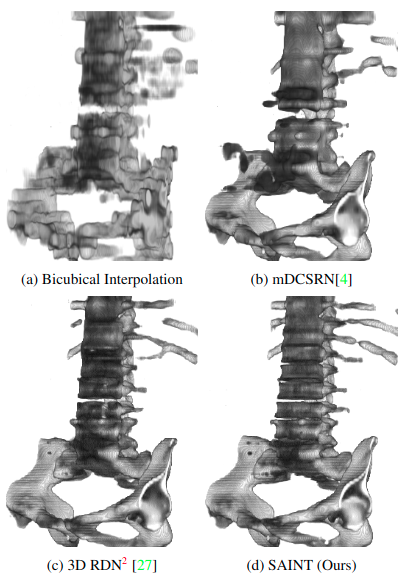

# SAINT: Spatially Aware Interpolation NeTwork for Medical Slice Synthesis




This is the code for SAINT: Spatially Aware Interpolation NeTwork for Medical Slice Synthesis (CVPR2020). 

```
@InProceedings{Peng_SAINT_CVPR2020,
  author = {Peng, Cheng and Lin, Wei-An and Liao, Haofu and Chellappa, Rama and Zhou, S. Kevin},
  title = {SAINT: Spatially Aware Interpolation NeTwork for Medical Slice Synthesis},
  booktitle = {The IEEE Conference on Computer Vision and Pattern Recognition (CVPR)},
  month = {June},
  year = {2020}
}
```

[Paper](https://arxiv.org/abs/2001.00704)

The framework of this codebase is derived from [EDSR-PyTorch](https://github.com/sanghyun-son/EDSR-PyTorch).


##Setup:

    conda create --name SAINT python=3.7
    conda activate SAINT
    pip install https://download.pytorch.org/whl/cpu/torch-1.0.0-cp37-cp37m-linux_x86_64.whl
    pip install tqdm imageio medpy scikit-image

##Data Preparation:

Data is obtained from the [Medical Decathlon Challenge (MSD)](http://medicaldecathlon.com/), specifically from the [Liver](https://drive.google.com/file/d/1jyVGUGyxKBXV6_9ivuZapQS8eUJXCIpu/view), [Colon](https://drive.google.com/file/d/1m7tMpE9qEcQGQjL_BdMD-Mvgmc44hG1Y/view), and [Hepatic Vessel](https://drive.google.com/file/d/1qVrpV7vmhIsUxFiH189LmAn0ALbAPrgS/view) dataset. After obtaining the files, run the following command to obtain the processed data. 

    python process/raw_data_process.py ~/Task10_Colon ~/data/COLON

Volumes with metal artifacts are removed, the intensity is clipped within a 4000 min-max range. Slices in Saggital and Coronal views are generated in TRAIN_SLICES for training. Volumes are saved in TRAIN_VOL and TEST, based on what is used as our test set in test_set.pt. 

##Evaluation:

You can try SAINT with our pre-trained checkpoint by running the following command:

    python3 main.py --scale 4 --save COLON --loss 1*L1 --model META_MULTI --epochs 150 --batch_size 1 --dir_data ~/data/COLON/ --data_train TRAIN_SLICES --data_test TEST --data_range 1-10000/1-24 --n_colors 3 --n_GPUs 1 --RDNconfig C --pre_train SAINT_ckpt/model_comb.pt --save_results --stage 2

This evaluates SR results based on X4 upsampling rate. Alternatively, change scale for different upsampling rate. Current checkpoint supports X4 and X6.  

To only evaluate the results from the first stage (MSR), change the "stage" flag to 1 instead. 

##Training:
### Marginal Super Resolution

Based on our data preparation, training can be done with the following command:

    python3 main.py --save COLON --loss 1*L1 --model META_MULTI --epochs 150 --batch_size 120 --dir_data ~/data/COLON/ --data_train TRAIN_SLICES --data_test TEST --data_range 1-X/1-Y --n_colors 3 --n_GPUs 6 --RDNconfig C --pre_train SAINT_ckpt/model_comb.pt --patch_size 10 --save_results

Note that:

* The training upsampling rates are fixed at X4 and X6, specifically in data/srdata.py -> def _load_file(); you are welcomed to change or add to the rates.
* The data_range should be modified with the intended # of training slices and validation volumes. 
* We recommend using the pre-trained ckpt as the starting point, although it can be turned off. 
* Patch size is determined such that the largest upsampling rate (e.g. X6) multiply by the patch size does not exceed the smallest volume in the axial/slice axis. In our case we make sure the volume at least has 60 slices. 

### Residual Fusion Network

    python3 main.py --scale 4 --save COLON --loss 1*L1 --model META_MULTI --epochs 150 --batch_size 1 --dir_data ~/data/COLON/ --data_train TRAIN_SLICES --data_test TRAIN_VOL --data_range 1-Y/1-X --n_colors 3 --n_GPUs 1 --RDNconfig C --pre_train SAINT_ckpt/model_comb.pt --save_results --stage 1
* SAINT is trained as a two-stage method; as such, we inference on the training set first to obtain data for the second stage. This can be achieved by running the command above.
* Axial slices can be generated from the inferenced volume by concatenating Sagittal and Coronal SR volume as torch.cat([sag, cor]).
* Freeze the main network and unfreeze the RFN component in model/\__init\__.py, then train RFN. 
* Based on the scale of the training data, inferencing the entire training set can be memory-wise intensive. To this end, we offer two potential solutions:
  * Use our pretrained RFN in the checkpoint; RFN is very lightweight and robust, we use the same network for X4 and X6 upsampling and find no significant improvement from dedicated training.
  * Use the average of Saggital and Coronal volume, which is a reasonable estimate that is about 0.2 dB worse than RFN based on our experiments. 


###TODO
* Training for RFN will be updated with more details. 


